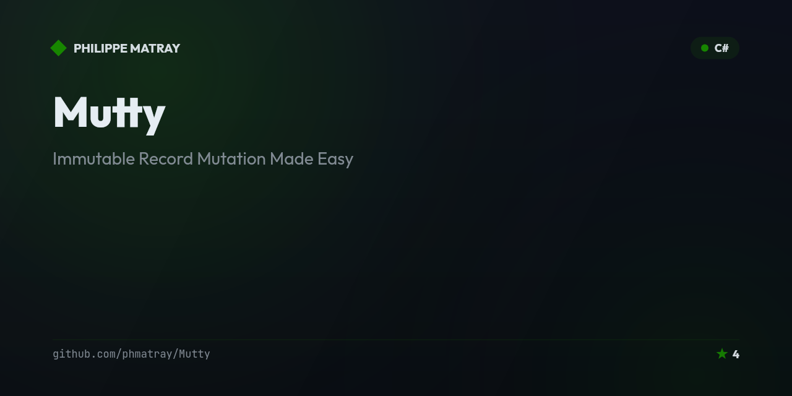
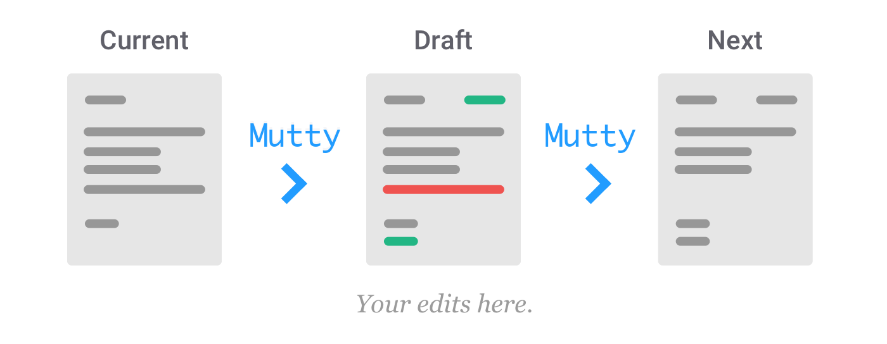

# Mutty

Immutable Record Mutation Made Easy

|  | Mutty is a C# Incremental Source Generator that provides a convenient way to work with immutable records by generating mutable wrappers for them. These wrappers allow you to modify properties of immutable records in a clean, controlled manner and then convert them back into immutable records. |
|-------------------------------------------------------------------------------|-------------------------------------------------------------------------------------------------------------------------------------------------------------------------------------------------------------------------------------------------------------------------------------------------------|

[](https://github.com/phmatray/Mutty "Go to GitHub repo")
[](LICENSE)
[](https://github.com/phmatray/Mutty)
[](https://github.com/phmatray/Mutty)

[](https://github.com/phmatray/Mutty/releases/)
[](https://github.com/phmatray/Mutty/issues)
[](https://github.com/phmatray/Mutty/pulls)
[](https://github.com/phmatray/Mutty/graphs/contributors)
[](https://github.com/phmatray/Mutty/commits/master)

---

---

## 📝 Table of Contents

<!-- TOC -->
* [Mutty](#mutty)
  * [📝 Table of Contents](#-table-of-contents)
  * [The Problem](#the-problem)
  * [The Solution](#the-solution)
  * [Quick Start](#quick-start)
  * [📌 Features](#-features)
  * [How Mutty Works](#how-mutty-works)
  * [Usage Patterns](#usage-patterns)
    * [`Produce` — the recommended way](#produce--the-recommended-way)
    * [Fluent `With` chaining](#fluent-with-chaining)
    * [`CreateDraft` / `FinishDraft` — granular control](#createdraft--finishdraft--granular-control)
    * [Validation with `OnBeforeBuild`](#validation-with-onbeforebuild)
    * [Converting back to immutable](#converting-back-to-immutable)
  * [What Gets Generated](#what-gets-generated)
  * [Supported Property Types](#supported-property-types)
  * [Diagnostics](#diagnostics)
  * [Ideal for Flux / Redux Architectures](#ideal-for-flux--redux-architectures)
  * [Installation & Compatibility](#installation--compatibility)
  * [Best Practices](#best-practices)
  * [Contributing](#contributing)
  * [License](#license)
<!-- TOC -->

---

## The Problem

C# records give you immutable data and a `with` expression to produce modified copies — which is wonderful, until your data is **nested**. Updating one deep value means rebuilding every record along the path by hand:

```csharp
// Change one lesson title, six levels deep — with plain records:
var updatedStudent = student with
{
    Enrollments = student.Enrollments.SetItem(0, student.Enrollments[0] with
    {
        Course = student.Enrollments[0].Course with
        {
            Modules = student.Enrollments[0].Course.Modules.SetItem(0, student.Enrollments[0].Course.Modules[0] with
            {
                Lessons = student.Enrollments[0].Course.Modules[0].Lessons.SetItem(0,
                    student.Enrollments[0].Course.Modules[0].Lessons[0] with
                    {
                        Title = "=== NEW TITLE ==="
                    })
            })
        }
    })
};
```

This is verbose, hard to read, and easy to get wrong — and it gets worse with every level of nesting and every collection in the path.

## The Solution

**Mutty** is a Roslyn incremental source generator. Annotate a record with `[MutableGeneration]` and it generates a *mutable wrapper* — a temporary, mutable proxy of your record. You make changes as if the data were mutable, and Mutty hands you back a brand-new immutable record. The same update becomes:

```csharp
// The same change, with Mutty:
Student updatedStudent = student.Produce(draft =>
{
    draft.Enrollments[0].Course.Modules[0].Lessons[0].Title = "=== NEW TITLE ===";
});
```

`student` is never touched. `updatedStudent` is a fresh immutable record, with structural sharing for the parts that didn't change. This is the same idea as [Immer](https://immerjs.github.io/immer/) in the JavaScript world, brought to C# records with zero runtime dependencies — all the wrapper code is generated at compile time.

## Quick Start

```bash
dotnet add package Mutty
```

```csharp
using Mutty;
using System.Collections.Immutable;

[MutableGeneration]
public record Student(string Name, int Age, ImmutableList<string> Courses);

// ...

var student = new Student("Ada", 30, ImmutableList.Create("Math"));

Student updated = student.Produce(draft =>
{
    draft.Name = "Ada Lovelace";
    draft.Age++;
    draft.Courses.Add("Computing");   // draft.Courses is a mutable List<string>
});

// student  -> unchanged
// updated  -> Student { Name = "Ada Lovelace", Age = 31, Courses = [Math, Computing] }
```

That's it — no base classes, no interfaces to implement, no reflection at runtime.

## 📌 Features

- **Automated mutable wrappers** — one `[MutableGeneration]` attribute generates a full `Mutable{Record}` wrapper via Roslyn incremental generation.
- **Deep-nesting support** — nested `[MutableGeneration]` records are wrapped recursively, so you can edit any depth with plain property assignments.
- **Collections made mutable** — `ImmutableArray`, `ImmutableList`, `ImmutableDictionary`, `ImmutableHashSet`, `ImmutableSortedSet`, `ImmutableSortedDictionary`, `ImmutableQueue`, `ImmutableStack`, plain arrays (`T[]`), and read-only collection interfaces are exposed as their mutable counterparts and converted back on build.
- **Fluent mutation** — chainable `With{Property}` setters: `student.Produce(d => d.WithName("Ada").WithAge(31))`.
- **Helper methods** — `Produce`, `CreateDraft`/`FinishDraft`, `AsMutable`/`ToImmutable` for collections.
- **Validation hook** — implement `partial void OnBeforeBuild()` to validate or normalize state before a record is produced.
- **Safe conversions** — an implicit conversion creates a draft; converting back is an explicit cast (or `Build()`), so allocations are never hidden.
- **Helpful diagnostics** — clear errors (`MUTTY001`–`MUTTY003`) when the attribute is used on something that can't be wrapped.
- **Fast & incremental** — a value-equatable pipeline means editing one record doesn't regenerate the others; broad toolchain support (Roslyn 4.8+).

## How Mutty Works

`[MutableGeneration]` marks the records you want wrappers for. At compile time the generator emits, per record:

- a `Mutable{Record}` class with read/write properties,
- a `Build()` method (and `ToImmutable()` alias) that produces the next immutable record via a `with` expression,
- `With{Property}` fluent setters and conversion operators,
- extension methods (`Produce`, `CreateDraft`, `FinishDraft`, `AsMutable`, `ToImmutable`).



Think of it like a personal assistant: you hand over a letter (the current state), the assistant gives you a working copy (the mutable draft) to scribble on, and when you're done it produces the clean, final letter (the next immutable state) — leaving your original untouched.

## Usage Patterns

### `Produce` — the recommended way

`Produce` wraps the record, runs your recipe, and returns the rebuilt record in one call:

```csharp
Student updated = student.Produce(draft =>
{
    draft.Name = "Ada Lovelace";
    draft.Details.Age = 31;            // nested record — just assign
    draft.Courses.Add("Computing");    // collection — it's a mutable List<T>
});
```

### Fluent `With` chaining

Every wrapper exposes chainable `With{Property}` setters that return the wrapper:

```csharp
Student updated = student.Produce(d => d
    .WithName("Ada Lovelace")
    .WithAge(31));
```

### `CreateDraft` / `FinishDraft` — granular control

When you need to hold the draft across several steps:

```csharp
MutableStudent draft = student.CreateDraft();
draft.Name = "Ada Lovelace";
draft.Age++;
Student updated = draft.FinishDraft();   // same as draft.Build()
```

### Validation with `OnBeforeBuild`

The wrapper is `partial`, so you can implement a hook that runs at the start of every `Build()`:

```csharp
public partial class MutableStudent
{
    partial void OnBeforeBuild()
    {
        if (Age < 0)
            throw new InvalidOperationException("Age cannot be negative.");
        Name = Name.Trim();
    }
}
```

### Converting back to immutable

- `draft.Build()` — produces the next immutable record (runs `OnBeforeBuild` first).
- `draft.ToImmutable()` — a more discoverable alias for `Build()`.
- `(Student)draft` — an **explicit** cast (it allocates a new record, so it's never implicit).
- The reverse — `Student` → `MutableStudent` — *is* implicit, because creating a draft is cheap and intentional.

## What Gets Generated

For a simple record:

```csharp
[MutableGeneration]
public record Person(string Name, int Age);
```

Mutty generates (abridged):

```csharp
public partial class MutablePerson
{
    public MutablePerson(Person record) { /* copies properties from the record */ }

    public string Name { get; set; }
    public int Age { get; set; }

    public Person Build()
    {
        OnBeforeBuild();
        return _record with { Name = this.Name, Age = this.Age };
    }

    public Person ToImmutable() => Build();
    partial void OnBeforeBuild();

    public MutablePerson WithName(string value) { Name = value; return this; }
    public MutablePerson WithAge(int value) { Age = value; return this; }

    public static implicit operator MutablePerson(Person record) => new(record);
    public static explicit operator Person(MutablePerson mutable) => mutable.Build();
}

public static class PersonExtensions
{
    public static Person Produce(this Person baseState, Action<MutablePerson> recipe) { /* ... */ }
    public static MutablePerson CreateDraft(this Person baseState) => new(baseState);
    public static Person FinishDraft(this MutablePerson draft) => draft.Build();
    public static List<MutablePerson> AsMutable(this IEnumerable<Person> states) { /* ... */ }
    public static ImmutableList<Person> ToImmutable(this IEnumerable<MutablePerson> states) { /* ... */ }
}
```

## Supported Property Types

| Property kind | Exposed on the wrapper as | Notes |
|---|---|---|
| Primitives, strings, enums, `DateTime`, `Guid`, … | the same type | plain get/set |
| Nested `[MutableGeneration]` record | `Mutable{Record}` | wrapped recursively; namespace-qualified |
| Record **not** annotated | the record type | kept by reference |
| `ImmutableArray<T>` / `ImmutableList<T>` | `List<T>` | `default(ImmutableArray<T>)` is handled safely |
| `ImmutableDictionary` / `ImmutableSortedDictionary` | `Dictionary` / `SortedDictionary` | |
| `ImmutableHashSet` / `ImmutableSortedSet` | `HashSet` / `SortedSet` | |
| `ImmutableQueue` / `ImmutableStack` | `Queue` / `Stack` | |
| `T[]` | `T[]` | defensively copied, never aliased |
| `IReadOnlyList<T>` / `IReadOnlyCollection<T>` | `List<T>` | |
| Nullable variants of all the above | nullable equivalent | |

Inherited record properties are included. Get-only / computed properties are skipped (they can't be set via `with`).

## Diagnostics

The bundled analyzer reports clear errors when `[MutableGeneration]` is used where a wrapper can't be generated:

| ID | Meaning |
|---|---|
| `MUTTY001` | The attribute was applied to a non-record (class, struct, interface, enum). |
| `MUTTY002` | The attribute was applied to a generic record (e.g. `record Box<T>`). |
| `MUTTY003` | The attribute was applied to a record nested inside another type. |

## Ideal for Flux / Redux Architectures

Mutty is a natural fit for state-management patterns (Flux, Redux, MVU). Reducers can express updates as straightforward mutations of a draft while the store stays immutable, predictable, and cheap to compare — especially when state is deeply nested.

```csharp
AppState Reduce(AppState state, RenameUserAction action) =>
    state.Produce(d => d.CurrentUser.Name = action.NewName);
```

## Installation & Compatibility

```bash
dotnet add package Mutty
```

1. **Annotate** your records with `[MutableGeneration]`.
2. **Build** — the incremental generator detects the annotated records and emits the wrappers and extensions during compilation. Nothing ships at runtime; Mutty is a development-time analyzer/generator package.

Mutty targets `netstandard2.0` and supports **Roslyn 4.8 and later** (Visual Studio 2022 17.8+, the .NET 8 SDK and newer), so it works across a broad range of toolchains.

## Best Practices

- **Immutable by default** — model your core data with immutable records; reach for a mutable draft only when you need to change something.
- **Mutate the draft, expose the record** — keep mutations local to a `Produce` recipe and return the immutable result.
- **Convert deliberately** — prefer `Build()` / `ToImmutable()` over the explicit cast; never rely on a hidden conversion.
- **Validate in one place** — use `OnBeforeBuild` for invariants and normalization so every code path goes through the same checks.

## Contributing

Contributions and issues are welcome:

- **Repository**: [Mutty on GitHub](https://github.com/phmatray/Mutty)
- **Issues**: use the GitHub Issues tab to report bugs or request features.

See [CONTRIBUTING.md](CONTRIBUTING.md) for development setup and guidelines.

## License

Mutty is open-source software licensed under the [Apache License 2.0](LICENSE).
